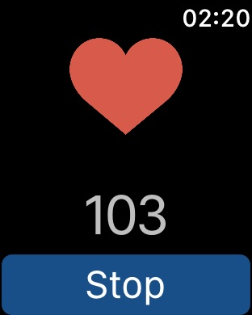

## October, 17th 2018

- Done with the health device application

- Connected PiCamera on the Raspberry Pi
- Will Start the server application while also doing the schematics for the bluetooth component soldering

## October, 14th 2018

- Discovered that just the iWatch can't work as a Beacon device. I need to pass the data to the  iOS application and then it will broadcast it.
- Created iOS Application that has a shared variable with the iWatch. It's the current heartRate.
- Apparently apple has 2 Frameworks: CoreLocation and CoreBluetooth.
  - CoreLocation: iBeacon Related
  - CoreBluetooth: GATT BLE 4.0 Related
- I've implemented the iBeacon stack, but I actually need the GATT.

## October, 13th 2018
- Half way through WatchOS app, I now have access to Heart Beats Per Minute

- Now I need to do the Bluetooth task.

## October, 12th 2018

- Started creating WatchOS app that monitors HeartBeat.
- Can't deploy it. Seems there's a bug, so I need to reinstall Xcode.
- So I lost half the day doing:
  - Reinstall Mojave
  - Reinstall Xcode
  - Talk to Apple Support (US)
  - Debugging
- The problem is very random and probably OS related. 
- For now, I need to keep my iPhone charged before plugin it in my Mac. Strange thing is that this problem happens only if the battery is less than ~50%. They were awere of this.
- I'll call Apple Brasil Tomorow as today is a holiday.

## October, 9th 2018

- Got the new BLE modules HM10 originals.
- Asked my Professor to allow me access to IDEIA lab.

## October, 6th 2018

- The BLE modules I've purchese were not original. Their Firmware was Bolutek's which has fewer instructions (AT commands). I'll keep them for the future, but decided to buy the originals.
- Apparently I can use IDEIA lab if one professor attests for me. Will look into it.
- I'll change my (non-existent) schedule, first will work on the Raspberry Pi, as it has already an embedded Bluetooth chip.

## October, 4th 2018

- BLE device operates in different modes [[Link]](https://www.eetimes.com/document.asp?doc_id=1278927)

  - Advertising mode
  - Scanning mode
  - master device
  - slave device
- Bought some Bolutek's BLE(CC41-A)

>  In advertising mode, the BLE device periodically transmits advertising information and may respond with more information upon request from other devices.  The scanner device, on the other hand, listens advertising information transmitted by other devices and may request additional information if active scan mode is enabled.  A scanner-only device works in passive mode whereby it only listens for advertising packets. In that case, only receiver functionality is required in the RF part of the design. Similarly, an advertising-only device may just have a transmitter part of the design. It definitely enables additional use cases with cost-sensitive applications. The fact that a stack may be partitioned in sections, which could be excluded if not used in a particular application, is a great opportunity to optimize the stack's size and use the MCU with a smaller FLASH/RAM memory footprint.

## September, 29th 2018

- Arduino has a EEPROM memory (Persistent) [[Link]](https://www.arduino.cc/en/Reference/EEPROM) 
- Sublime Text 3 Arduino IDE Deviot [[Link]](https://github.com/gepd/Deviot)
- PlatformIO IDE [[Link]](https://platformio.org/platformio-ide)

## September, 28th 2018

- Found out I can use [HM-10 BLE](docs/HM-10-as-iBeacon.pdf)
- Bluetooth has commands AT
- Bluetooth Interfacing with HM-10[[Link]](http://fab.cba.mit.edu/classes/863.15/doc/tutorials/programming/bluetooth.html)
- Apple's CoreLocation API [[Link]](https://developer.apple.com/documentation/corelocation/determining_the_proximity_to_an_ibeacon)
- Get help from beacon: AT+HELP?

